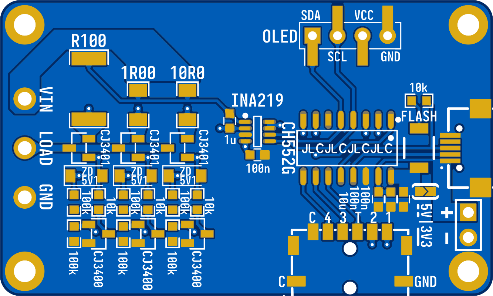

# CH552 Power Monitor

A tiny low-cost voltmeter and ammeter by CH552 & INA219. The meter uses INA219 to measure voltage, current, and power. 3 current sensing shunt resistors are used to measure current from 1 mA to 3.2 A.

## Shunt Resistors

To increase measurement accuracy in different ranges, 3 current sensing shunt resistors are used, the VCC voltage drop and the shunt resistor power consumption are also controlled.

| #   |    Resistor | Power Rating |    Tolerance | Package | Current Sensing Range | Voltage Drop      |
| --- | ----------: | -----------: | -----------: | ------- | --------------------- | ----------------- |
| 0   | 0.1 &Omega; |           2W |   &plusmn;1% | 2512    | (80 mA, 3.2 A)        | (0.008 V, 0.32 V) |
| 1   |   1 &Omega; |         1/4W |   &plusmn;1% | 1206    | (8 mA, 100 mA)        | (0.008 V, 0.10 V) |
| 2   |  10 &Omega; |         1/8W | &plusmn;0.1% | 0805    | [1 mA, 10 mA)         | (0.010 V, 0.10 V) |

## Shunt Resistor Switching

P-channel MOSFETs are used to switch the shunt resistors on high-side, the voltage sampling point is placed between the shunt resistor and the the MOSFET to remove the voltage drop on MOSFET, this is important especially for small shunt resistors, such as 0.1 &Omega;.

P-channel MOSFET selection,

- `Vds` should be higher than the maximum voltage of the measurement.
- `Id` should be higher than the maximum current of the measurement.
- `Vgs` should be as small as possible, so it can measure the current in a low voltage.
- `Rds(on)` should be small enough to reduce voltage drop to the load.

CJ3401 is selected consider it satisfied the conditions above and its low cost.

The switching strategy,

- By default, the smallest shunt resistor is turned on to avoid the risk of high current through the circuit.
- If the measured current is out of the range of the current shunt resistor, turn on another shunt resistor and then turn off the current shunt resistor, by doing this the load will not be interrupted.

**Simplified Shunt Resistor Switching Schematic**

## Shunt Resistor Transition Hysteresis

A 20% transition hysteresis is used to avoid switching shunt resistor back and forth.

## Schematic

## PCB

## References

- Current Ranger (https://lowpowerlab.com/guide/currentranger)
- CH552-USB-OLED (https://github.com/wagiminator/CH552-USB-OLED)
